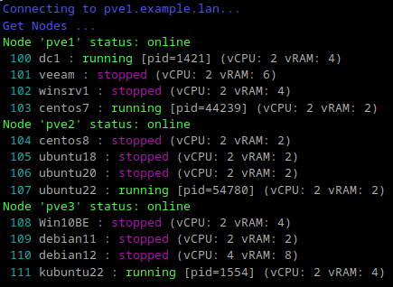
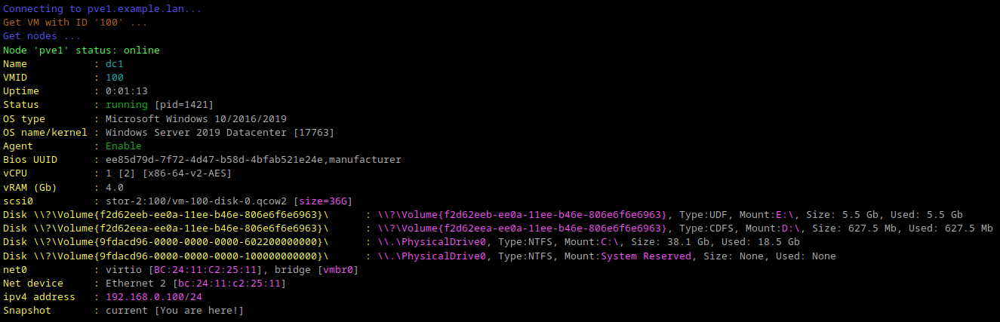
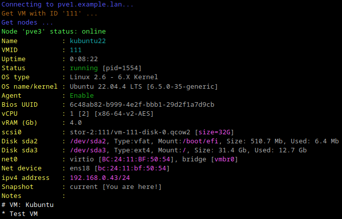
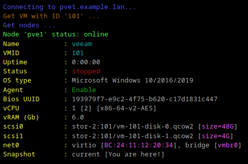

## Proxmox VM list/search



This simple python3 script may list VMs from Proxmox server or Proxmox cluster. Also may search VM by name, ip and id.
In search result it show VM details info. Script tested on Proxmox 7.4 and 8.2 version.

### Setup
Script depends from some packets. Run:
```
pip3 install proxmoxer
pip3 install requests
pip3 install paramiko
pip3 install colorama
```
Or run:
```
pip3 install -r requirements.txt
```

### Usage:
```
Run pve-vm-info.py with options:
-s, --server    PVE hostname or IP
-n, --vmname    Search by VM name
-i, --vmid      Search by VM ID
-a, --ipv4addr  Search by VM IPv4 address
-u, --user      PVE user
-p, --passwd    PVE password
--ssl           Use secure connection, <True|False>
-t, --template  Search VM templates too, <True|False>
-e, --export    Export VMs list to csv file, <True|False>

Do not mix [-n], [-i] and [-a] options
Use [-e] without [-n], [-i] and [-a] options
```

### Environments vars:
```
PVE_VM_INFO_USER=username             - To set proxmox username@pam, username@pve
PVE_VM_INFO_PASS=password             - To set proxmox password
REQUESTS_CA_BUNDLE=/path/to/certs.crt - To use secure connection for 'requests'
```

### Examples:
```
pve-vm-info.py -s pve1.example.lan -u root@pam -p YourP@ss
pve-vm-info.py -s pve1.example.lan -u admin@pam -p -t True
pve-vm-info.py -s pve1.example.lan -u viewer@pve -p YourP@ss -n VM1
pve-vm-info.py -s pve1.example.lan -u viewer@pve -p -i 100
pve-vm-info.py -s pve1.example.lan -a 192.168.1.2
pve-vm-info.py -s pve1.example.lan --ssl True -t True
pve-vm-info.py -s pve1.example.lan -e True
```




